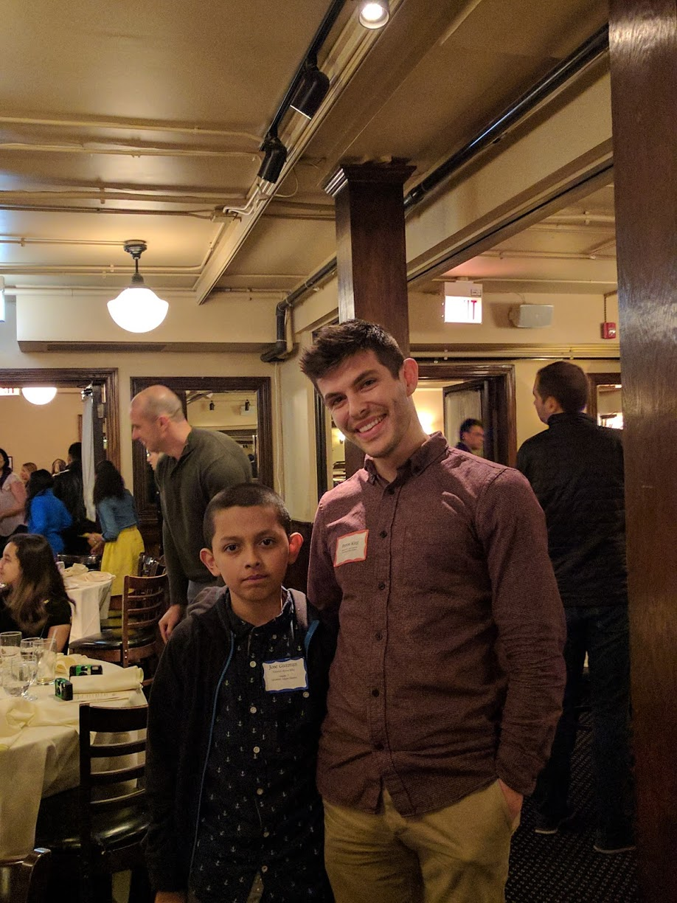

 

## **Who Is My Tutor?**

My tutor's name is Byron. He is 24 years old. We both like sports and working with numbers. We have known each other for 1 year. My tutor works as a statistician. This is his favorite equation:

$0 = e^(i\pi) + 1$ 

## **What Have I Learned in Tutoring?**

I learned how to improve my reading skills. I improve my reading skills by reading books and magazine articles every day. I also learned how to write, by writing a short essay after reading an article. I wrote a short essay during almost every tutoring session. Most importantly, I learned to be more confident in my abilities.

## **What Is My Most Memorable Moment?**

My most memorable moment was when I went to an Italian restaurant with my tutor. My favorite part was taking pictures inside the restaurant with Kodak cameras. Here is a picture we took with those cameras:

